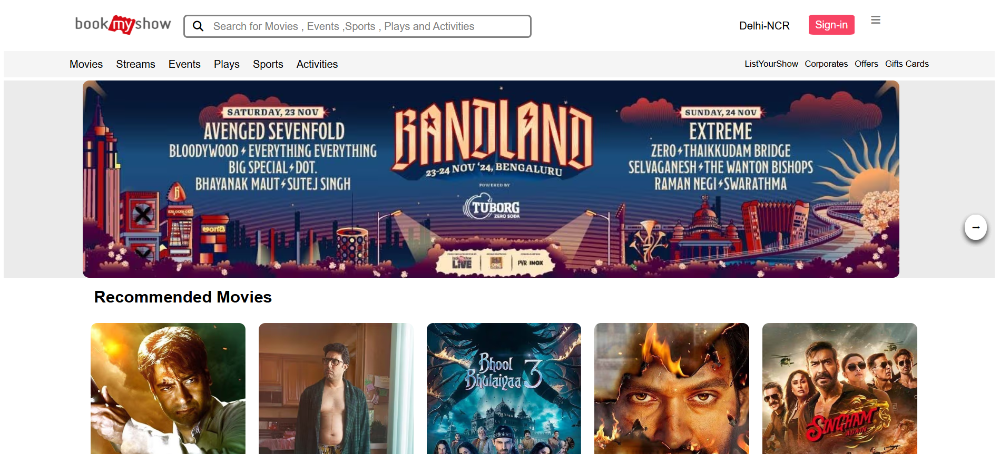
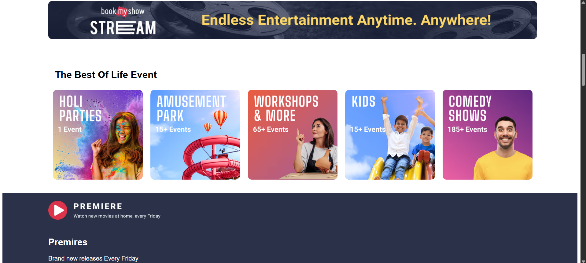
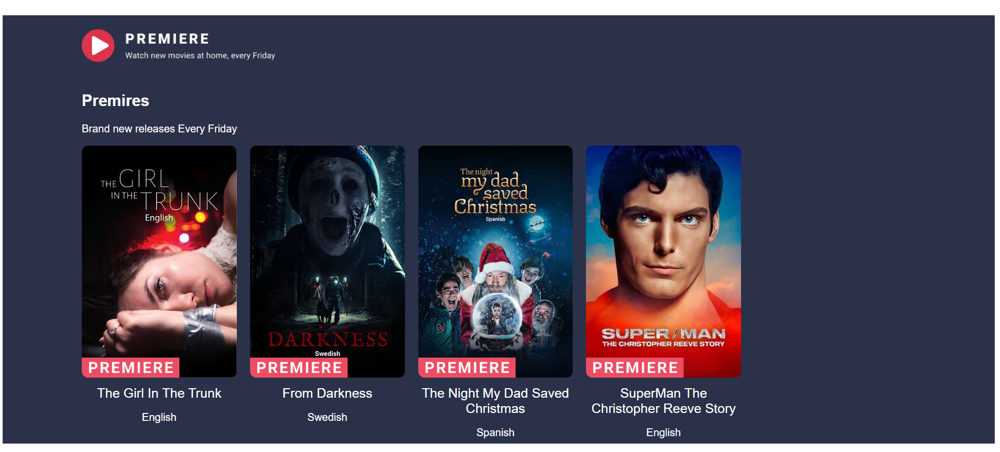
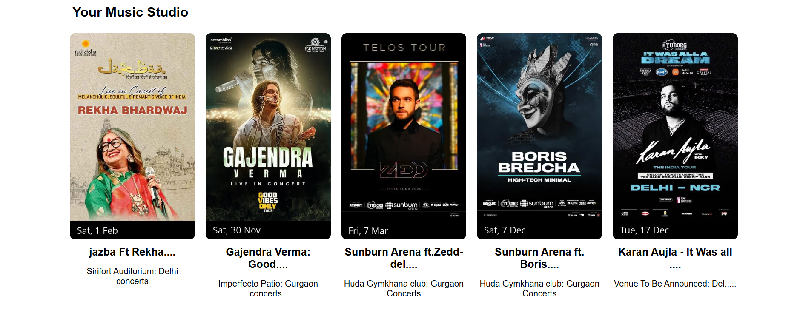
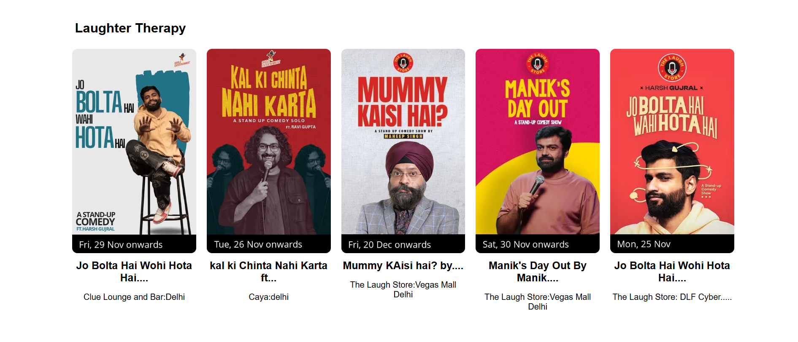
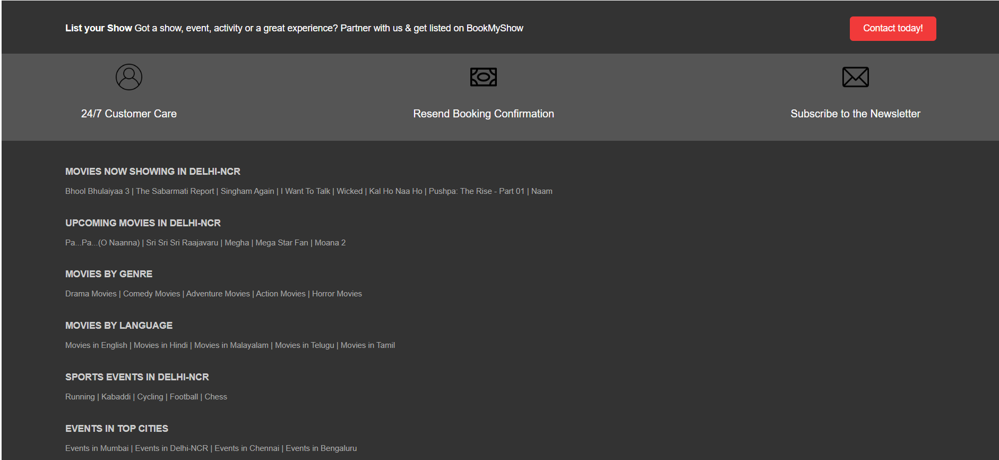

<h1 align = "center">🎟️ BookMyShow Clone (Front-end)</h1>

- A clone of BookMyShow, the popular online ticket booking platform.
- Building this with intention of learning HTML, CSS.

---

**📸 Screenshots**
---

<table border="1">
  <thead>
    <tr>
      <th style="text-align:center;" >1</th>
      <th style="text-align:center;">2</th>
    </tr>
  </thead>
  <tbody>
    <tr>
      <td></img></td>
      <td></img></td>
    </tr>
  </tbody>
</table>

<table border="1">
  <thead>
    <tr>
      <th style="text-align:center;" >3</th>
      <th style="text-align:center;">4</th>
    </tr>
  </thead>
  <tbody>
    <tr>
      <td></img></td>
      <td></img></td>
    </tr>
  </tbody>
</table>

<table border="1">
  <thead>
    <tr>
      <th style="text-align:center;" >5</th>
      <th style="text-align:center;">6</th>
    </tr>
  </thead>
  <tbody>
    <tr>
      <td></img></td>
      <td></img></td>
    </tr>
  </tbody>
</table>

